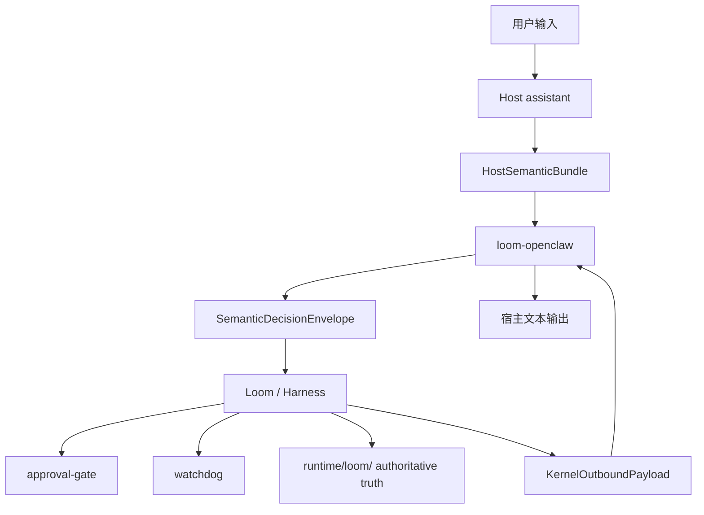

# 治理架构

更新时间：2026-03-11

---

## 1. 文档定位
这份文档只描述 Loom 套件的目标架构。

它回答 4 个问题：
1. `Loom`、`Harness`、`watchdog`、`approval-gate`、`loom-openclaw` 分别负责什么。
2. `host_session_id`、`managedTaskRef`、`activeManagedTaskRef` 分别代表什么。
3. `Stage Pool`、`Agent Pool`、`Pack` 三者怎样配合。
4. 为什么未来开发必须以 `runtime/loom/` 为唯一治理真相源。

字段细节和接口细节下沉到 [目录说明.md](../核心设计/目录说明.md)。

---

## 2. 架构主张
### 2.1 总体目标
Loom 不是下一个 assistant，也不是下一个模型平台。  
它是给个人 AI 终端补上的一层任务治理内核。

固定原则：
1. 默认体验先走 `chat lane`。
2. 只有明确需要被治理、被跟踪、可能被委派的工作，才进入 `managed task lane`。
3. kernel 不做自然语言语义推断，只消费宿主给出的结构化判断。
4. 主聊天与 active managed task 并行存在。
5. `runtime/loom/` 是唯一 authoritative truth。

### 2.2 三层分工
Loom 架构固定拆成三层：
1. 宿主语义层
   - 负责理解用户输入。
   - 产出 `HostSemanticBundle`。
2. Loom 治理层
   - 负责 `managedTaskRef`、`PhasePlan`、`ExecutionAuthorization`、review、result、boundary。
3. 宿主 adapter 层
   - 负责 ingress/egress、能力映射、文本渲染和桥接。

这三层必须分开。  
如果 adapter 重新做语义判断，或者 kernel 重新猜自然语言，系统会重新长出双真相源。

### 2.3 五个 bounded contexts
在这三层分工之下，Loom 的领域模型固定再切成 5 个 bounded contexts：
1. 宿主输入 context
   - `CurrentTurnEnvelope / HostSemanticBundle / SemanticDecisionEnvelope / HostCapabilitySnapshot`
2. 任务治理 context
   - `managedTaskRef / TaskScopeSnapshot / PhasePlan / PendingDecisionWindow / ChangeImpactAssessment`
3. 执行与授权 context
   - `AgentBinding / IsolatedTaskRun / ExecutionAuthorization / CapabilityDriftAssessment / RiskAssessment`
4. review / result context
   - `ReviewResult / ProofOfWorkBundle / ResultContract`
5. notice / outbox context
   - `watchdogNoticeState / KernelOutboundPayload / OutboundDelivery`

固定规则：
1. 看起来字段相近，不代表应该跨 context 合并
2. 新 noun 必须先回答自己属于哪个 context
3. 如果回答不出来，就先不要升格成独立正式对象

---

## 3. 顶层对象与 owner
### 3.1 输入与会话
| 对象 | 它是什么 | owner | 作用 |
| --- | --- | --- | --- |
| `CurrentTurnEnvelope` | 当前宿主输入的权威入站对象 | adapter ingress | 固定“当前输入是谁” |
| `host_session_id` | 宿主聊天容器 | host assistant | 承接聊天连续性，不承接任务状态 |
| `HostSemanticBundle` | 宿主语义层的综合结构化判断包 | host semantic layer | 把 lane、class、change、horizon 等宿主判断绑成一个语义包 |
| `SemanticDecisionEnvelope` | adapter 归一化后的 bounded judgment | `loom-openclaw` | 作为 Loom 可直接消费的治理输入 |

### 3.2 任务与治理状态
| 对象 | 它是什么 | owner | 作用 |
| --- | --- | --- | --- |
| `managedTaskRef` | 单个受管任务的一等引用 | Loom | candidate、active、result、closed 的共同 owner |
| `activeManagedTaskRef` | 当前唯一 active task 指针 | Loom session projection | 保留单活跃任务约束，但不冻结聊天 |
| `managedTaskClass` | 受管任务的协作拓扑和治理强度 | Loom | 固定为 `COMPLEX / HUGE / MAX` |
| `workflowStage` | 单个受管任务当前阶段 | Loom | 固定主阶段：`candidate / execute / review / result / closed` |
| `TaskScopeSnapshot` | 当前任务范围和工程上下文快照 | Loom | 持有 requirement、约束和第一版工程上下文字段 |
| `HandoffContract` | 多 agent 协作中的最小正式交接记录 | Loom | 只承接 `HUGE / MAX` 的单次责任转移，不引入责任图 |
| `SpecBundle` | 正式执行锚点文档组 | Loom | 持有 scope/plan/verification 活文档 |
| `IsolatedTaskRun` | 执行期隔离 run | Loom | 承接 run 边界、artifact 和 run 级事件链 |
| `ProofOfWorkBundle` | 任务交付证据包 | Loom | 绑定 run、review、artifact、acceptance 证据 |
| `pendingUserDecision` | 当前任务 projection 上指向 open `PendingDecisionWindow` 的指针 | Loom task projection | 把 start card、approval 等窗口投影回当前任务上下文 |
| `pendingBoundaryConfirmation` | `BoundaryConfirmation` 窗口的专门扩展子实体 | Loom | 绑定 active/candidate/boundary_reason，防止任务静默替换 |
| `decision_token` | 由 `PendingDecisionWindow` 持有生命周期的消费令牌 | Loom | 防止迟到回复串线和重复消费 |
| `RiskAssessment` | 当前任务基线风险或动作覆盖风险的正式评估结果 | Loom | 驱动治理装配、授权收紧和审批升级 |

### 3.3 资源池与策略
| 对象 | 它是什么 | owner | 作用 |
| --- | --- | --- | --- |
| `Stage Pool` | 可复用阶段模板池 | Loom | 定义阶段积木 |
| `Agent Pool` | 可复用 agent 能力池 | Loom + host mapping | 定义角色与能力来源 |
| `Pack` | 面向场景的默认工作模式包 | Loom | 定义默认阶段、角色和治理骨架 |
| `SpecBundle` | 活文档锚点组 | Loom | 让任务范围、计划、验证形成正式文档组 |
| `ProofOfWorkBundle` | 正式证据包 | Loom | 让结果不是口头 summary，而是证据化交付 |
| `AcceptancePolicy` | 什么叫完成 | Loom | 定义阶段级与任务级验收 |
| `BudgetPolicy` | 时间/模型/尝试预算 | Loom | 防止任务无限自转 |
| `WipPolicy` | 活跃工作流量治理规则 | Loom | 支撑 watchdog 与单活跃任务约束 |

固定治理装配顺序：
1. `HostCapabilitySnapshot` 约束
2. 内核强制安全规则
3. `PackContract` 默认
4. `managedTaskClass`
5. `RiskAssessment`
6. 用户在 `override_policy` 允许范围内的显式覆盖

---

## 4. Loom 套件职责
### 4.1 `Harness`
`Harness` 是 Loom 的核心治理运行时。

它负责：
1. 根据 `Pack` 生成默认 `PhasePlan`。
2. 根据 `Pack` 和当前 task scope 生成 `SpecBundle`。
3. 在 execute 期创建和推进 `IsolatedTaskRun`。
4. 推进 `workflowStage`。
5. 建立和更新 `AgentBinding`。
6. 管理 start card、boundary、review、result 主链。
7. 在结果阶段编译 `ProofOfWorkBundle`。
8. 写入 `runtime/loom/` authoritative state。
9. 如发生正式交接，写入最小 `HandoffContract`。

它不负责：
1. 理解自由文本。
2. 直接持有宿主 UI。
3. 代替 `approval-gate` 决定高风险动作是否放行。
4. 代替 `watchdog` 做 notice 去重。

### 4.2 `approval-gate`
`approval-gate` 负责写边界和高风险动作边界。

它消费：
1. `ExecutionAuthorization`
2. `DelegationLevel`
3. `DecisionArea`
4. 当前生效 `RiskAssessment`

它输出：
1. `allow`
2. `deny`
3. `requires_user_approval`

它不负责：
1. lane 判定
2. task class 判定
3. result 文本渲染

### 4.3 `watchdog`
`watchdog` 负责主动通知。

它消费：
1. `TaskEvent`
2. `WorkItemState`
3. `watchdogNoticeState`
4. `WipPolicy.escalation_policy`
5. `ReworkPolicy.escalation_policy`
6. `AcceptancePolicy.escalation_policy`

它输出：
1. 阶段进入/完成通知
2. `blocked`/aging 升级
3. 需要用户拍板的 notice

它不负责：
1. 语义判断
2. 阶段推进
3. 执行授权

固定注意力边界：
1. 第一版注意力治理继续并入 `watchdogNoticeState + ...escalation_policy`
2. 不引入独立 `AttentionPolicy`

### 4.4 `loom-openclaw`
`loom-openclaw` 是 OpenClaw 的薄 adapter。

它负责：
1. ingest `CurrentTurnEnvelope`
2. 接住宿主语义 ingress，并归一化出 `SemanticDecisionEnvelope`
3. capability sync
4. `KernelOutboundPayload` 文本渲染
5. control action 回传

它不负责：
1. 发明新的 payload 结构
2. 发明新的治理默认值
3. 把宿主兼容投影重新当成 authoritative truth

---

## 5. 资源池、Pack 与协作拓扑
### 5.1 `Stage Pool`
`Stage Pool` 定义可复用阶段模板。  
它回答“任务怎么推进”。

当前最重要的阶段是：
1. `clarify`
2. `execute`
3. `review`
4. `deliver`

固定边界：
1. 这些阶段名属于 `StagePackageId / PhasePlan` 层
2. 不是顶层 `workflowStage` 扩展枚举

### 5.2 `Agent Pool`
`Agent Pool` 定义可实例化角色与能力。  
它回答“谁来干活”。

当前固定角色：
1. `net`
2. `recorder`
3. `worker`
4. `reviewer`
5. `platform`
6. `facilitator`

### 5.3 `Pack`
`Pack` 是对用户可见的工作模式包。  
它把场景、阶段骨架、角色骨架、默认治理策略绑在一起。

当前正式 preset：
1. `coding_pack`
2. `research_pack`

每个 pack 都必须同时约束：
1. 默认 `PhasePlan` 骨架
2. 默认 `SpecBundle` 形态
3. 默认 `ProofOfWorkBundle` 形态

### 5.4 `managedTaskClass`
Loom 当前正式 managed class 只有：
1. `COMPLEX`
   - `net + recorder + 1 worker`
2. `HUGE`
   - `1 + n` 多 worker 协作
3. `MAX`
   - 项目级分层协作

这不是“任务大小档位”，而是“协作拓扑和治理强度档位”。

---

## 6. 运行时真相源
### 6.1 `runtime/loom/`
`runtime/loom/` 是 Loom 的唯一 authoritative truth root。

建议固定包含：
1. `tasks/`
2. `events/`
3. `projections/`
4. `notices/`
5. `host-bridges/`
6. `runs/`

### 6.2 authoritative truth 与 projection
Loom 运行时固定采用：
1. authoritative store
2. append-only task events
3. projection 供 adapter 和调试读取

这里最重要的取舍是：
1. authoritative truth 只存在一份。
2. projection 可以很多份。
3. compatibility projection 永远不是 authoritative truth。

### 6.3 compatibility projection
宿主兼容投影在 Loom 文档里只允许以 compatibility projection 身份出现。  
它不再承接产品语义，不再承接 future development 的真相源角色。

---

## 7. 架构总图

---

## 8. 当前结论
未来开发只允许沿着这条链继续细化：
1. 宿主做语义理解
2. adapter 做归一化和桥接
3. Loom 做任务治理真相源
4. `approval-gate`、`watchdog` 各守单一职责
5. `runtime/loom/` 作为唯一 authoritative truth 持续收口
