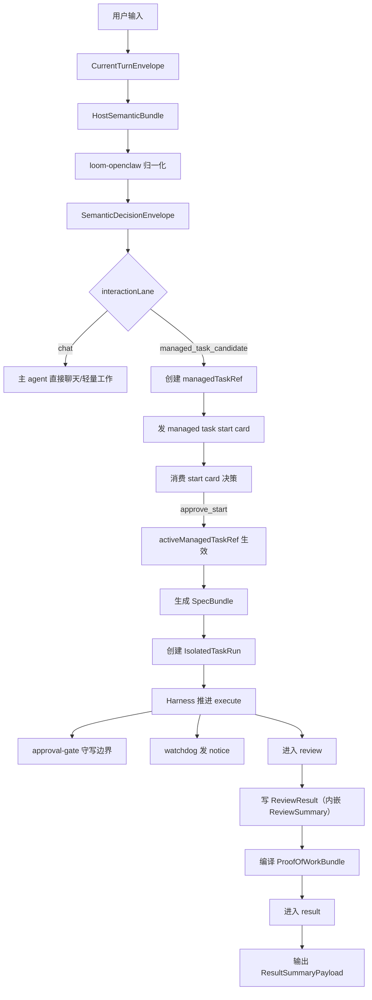

# 治理链路图

更新时间：2026-03-10

---

## 1. 文档定位
这份文档把 Loom 的顶层链路画成一条连续主线：
1. 用户输入如何进入系统
2. 宿主语义如何进入 Loom
3. candidate/start/review/result 如何推进
4. watchdog 和 approval-gate 在哪里插入

它只描述 Loom 主线。

---

## 2. 主链总图

---

## 3. 第一层：宿主输入到 Loom
### 3.1 `CurrentTurnEnvelope`
它是什么：
1. 当前宿主输入的权威入站对象

它代表：
1. 当前输入是谁
2. 当前输入来自哪个 `host_session_id`

### 3.2 `HostSemanticBundle`
它是什么：
1. 宿主语义层对当前输入的综合结构化判断包

它至少回答：
1. `interactionLane`
2. `taskActivationReason`
3. `managedTaskClass`
4. `WorkHorizon`
5. 必要时的 change / boundary / control judgment

### 3.3 `SemanticDecisionEnvelope`
它是什么：
1. adapter 归一化后的 bounded judgment

它解决：
1. Loom 不再读取自然语言原文猜 lane
2. 宿主判断和 Loom 治理解耦

---

## 4. 第二层：双车道分流
### 4.1 `chat lane`
`chat lane` 承接：
1. 普通聊天
2. 问答
3. 轻量工作
4. active task 存在时的并行聊天

这条线的结果是：
1. 不创建 `managedTaskRef`
2. 不打开 start card
3. 不写任务治理状态

### 4.2 `managed task lane`
`managed task lane` 承接：
1. 明确要被治理的工作
2. 需要阶段流转、review、result、通知、边界管理的任务

managed lane 的正式档位只有：
1. `COMPLEX`
2. `HUGE`
3. `MAX`

---

## 5. 第三层：candidate 到 active
### 5.1 candidate 创建
进入 `managed_task_candidate` 后，系统必须先创建 `managedTaskRef`。

原因：
1. start card 必须有 owner
2. 后续 `approve_start / modify_candidate / cancel_candidate` 必须都作用在同一个对象上

### 5.2 `managed task start card`
start card 是 managed lane 的第一条用户可见消息。

它必须至少说明：
1. 这项任务会被怎样治理
2. 当前建议的 `managedTaskClass`
3. 当前 `WorkHorizon`
4. 这项任务为什么进入 managed lane

它的正式决策集合固定为：
1. `approve_start`
2. `modify_candidate`
3. `cancel_candidate`

### 5.3 `pendingUserDecision`
它是什么：
1. 当前任务 projection 上指向 open `PendingDecisionWindow` 的指针

它的意义是：
1. `StartCandidate` 必须先打开正式决策窗口
2. 再把当前窗口投影为 `pendingUserDecision`
3. 再由 Loom 发 `StartCardPayload`
4. start card 回复先被结构化
5. 再由 Loom 推进状态
6. 不能用自然语言直接跳状态

---

## 6. 第四层：active 任务主链
### 6.1 `activeManagedTaskRef`
`approve_start` 消费后：
1. `activeManagedTaskRef = managedTaskRef`
2. `workflowStage = execute`

这表示：
1. 当前有一个 active task 在跑
2. 但主聊天仍保持开放

### 6.2 `Harness`
在 active task 期间，`Harness` 负责：
1. 根据 `Pack` 与 `PhasePlan` 推进阶段
2. 建立和更新 `AgentBinding`
3. 生成和修订 `SpecBundle`
4. 维护当前 `TaskScopeSnapshot`
5. 维护当前 `RiskAssessment`
6. 创建和推进 `IsolatedTaskRun`
7. 协调 `review` 与 `result`
8. 编译 `ProofOfWorkBundle`

固定阶段层级：
1. `workflowStage`
   - 只保留粗粒度：
     - `candidate / execute / review / result / closed`
2. `clarify / source_collection / synthesis / deliver`
   - 都属于 `PhasePlan` / `StagePackageId` 层
   - 不是 `workflowStage` 扩展枚举

### 6.3 `approval-gate`
`approval-gate` 插在 execute 主链上：
1. 读取 `ExecutionAuthorization`
2. 读取当前 `RiskAssessment`
3. 决定当前高风险动作是否：
   - `allow`
   - `deny`
   - `requires_user_approval`

### 6.4 `watchdog`
`watchdog` 插在 active task 主链的旁路：
1. 监听关键进展
2. 发异步 notice
3. 做去重和升级

---

## 7. 第五层：review 与 result
### 7.1 `review`
Loom 的最小可运行主链必须显式包含 `review`。

因为：
1. 没有 review，系统只能证明“任务能跑”
2. 不能证明“任务被治理”

### 7.2 `ReviewResult`
review 阶段至少要产出：
1. `ReviewResult`
2. 其中内嵌 `ReviewSummary`

它被：
1. `AcceptancePolicy` 消费
2. `ResultContract` 引用

### 7.3 `ResultSummaryPayload`
最终回宿主聊天区的结果摘要必须来自结构化结果，而不是 adapter 临时拼文案。

它至少带：
1. `managed_task_ref`
2. `acceptance_verdict`
3. `summary`
4. `proof_of_work_excerpt`
5. `proof_of_work_excerpt.review_summary`

固定边界：
1. `ResultSummaryPayload`
   - 只是 `ProofOfWorkBundle` 的用户可见摘录
2. 不允许在顶层链路图里再发明第二套结果字段名

---

## 8. 第六层：变更与边界
### 8.1 `request_task_change`
active task 期间，用户可以持续提变更。

这条链固定为：
1. 宿主语义层先结构化 change
2. Loom 更新 `TaskScopeSnapshot`
3. Loom 产出 `ChangeImpactAssessment`
4. 必要时重排 `PhasePlan`、重做 review、重算 acceptance
5. 必要时重评 `RiskAssessment`

### 8.2 `pendingBoundaryConfirmation`
当 active task 存在，又来了第二项重任务：
1. 不能静默吞进当前任务
2. 不能静默替换当前任务
3. 必须先打开 `PendingDecisionWindow(kind=BoundaryConfirmation)`
4. 再创建 `pendingBoundaryConfirmation` 扩展子实体
5. 再发 `BoundaryCardPayload`
6. 该窗口至少绑定：
   - 当前 active task owner
   - 当前 boundary candidate owner
   - 当前 `decision_token`

边界决策集合固定为：
1. `keep_current_task`
2. `replace_active`

---

## 9. 第七层：authoritative truth
### 9.1 `runtime/loom/`
Loom 的 authoritative truth 固定写到 `runtime/loom/`。

### 9.2 projection
adapter、调试、通知都只能读 projection，不能回写 authoritative truth。

### 9.3 compatibility
宿主兼容投影只允许作为 compatibility projection 存在，不再作为产品链路说明的一部分。

---

## 10. 当前结论
Loom 的完整链路已经固定成：
1. 宿主理解输入
2. adapter 归一化
3. Loom 进入双车道
4. candidate/start/execute/review/result 推进
5. approval/watchdog 在各自边界上插入
6. authoritative truth 全部回到 `runtime/loom/`
