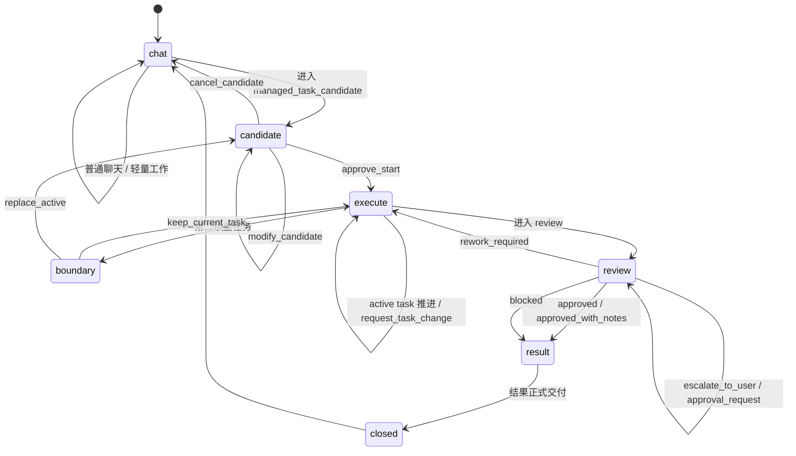

# 状态机附录

更新时间：2026-03-11

---

## 1. 文档定位
这份附录把 Loom 的顶层状态机压缩成最容易映射到代码的版本。  
正式语义以 [运行时语义.md](运行时语义.md) 为准。

---

## 2. 顶层状态机


---

## 3. 关键对象速记
| 对象 | 它是什么 | 作用 |
| --- | --- | --- |
| `HostSemanticBundle` | 宿主语义层的综合结构化判断包 | 提供 lane/class/change/horizon 的宿主判断 |
| `SemanticDecisionEnvelope` | adapter 归一化后的 bounded judgment | Loom 正式消费的治理输入 |
| `interactionLane` | 当前输入进哪条车道 | 决定是否启 Loom |
| `managedTaskRef` | 单个受管任务 owner | candidate、active、result 的共同 owner |
| `activeManagedTaskRef` | 当前唯一 active task 指针 | 保留单活跃任务约束 |
| `managedTaskClass` | 正式协作档位 | `COMPLEX / HUGE / MAX` |
| `workflowStage` | 粗粒度治理生命周期 | `candidate / execute / review / result / closed` |
| `pendingUserDecision` | 当前任务 projection 上指向 open `PendingDecisionWindow` 的指针 | 承接 start card、approval 等窗口投影 |
| `pendingBoundaryConfirmation` | `BoundaryConfirmation` 窗口的边界扩展子实体 | 绑定 active/candidate/boundary_reason，防止任务静默替换 |
| `decision_token` | 决策窗口令牌 | 防止迟到回复串线 |
| `SpecBundle` | 正式执行锚点文档组 | 锚定 scope/plan/verification |
| `IsolatedTaskRun` | 执行期隔离 run | 承接 run 边界、artifact、evidence |
| `ProofOfWorkBundle` | 正式交付证据包 | 绑定 run、review、artifact、acceptance |

---

## 4. 核心伪代码
以下伪代码统一站在“adapter 已把 `HostSemanticBundle` 归一化成 decision set”之后的视角表达。  
kernel 不直接消费 raw bundle。

### 4.1 lane 仲裁
```ts
function chooseLane(decisions, activeManagedTaskRef) {
  if (decisions.interactionLane.value === "chat") {
    return "chat";
  }

  if (!activeManagedTaskRef) {
    return "managed_task_candidate";
  }

  if (decisions.boundaryRecommendation?.value === "open_boundary_confirmation") {
    return "managed_task_active_boundary";
  }

  return "managed_task_active";
}
```

### 4.2 candidate 创建
```ts
function createCandidate(decisions) {
  return {
    managedTaskRef: createTaskRef(),
    managedTaskClass: decisions.managedTaskClass.value,
    workflowStage: "candidate",
    taskActivationReason: decisions.taskActivationReason.value,
    workHorizon: decisions.workHorizon.value,
  };
}
```

### 4.3 start card 决策消费
```ts
function consumeStartDecision(task, decision) {
  const window = loadPendingDecisionWindow(task.pendingUserDecision.windowRef);
  assert(decision.decisionToken === window.decisionToken);
  assert(window.kind === "StartCandidate");

  switch (decision.kind) {
    case "approve_start":
      task.workflowStage = "execute";
      return { activate: true, createSpecBundle: true, createIsolatedTaskRun: true };
    case "modify_candidate":
      task.workflowStage = "candidate";
      return { reissueStartCard: true };
    case "cancel_candidate":
      task.workflowStage = "closed";
      return { backToChat: true };
  }
}
```

### 4.4 review 与 result
```ts
function completeReview(task, reviewResult) {
  if (reviewResult.reviewVerdict === "escalate_to_user") {
    return {
      openPendingDecisionWindow: "ApprovalRequest",
      projectPendingUserDecision: true,
      emitApprovalRequestPayload: true,
      keepInReview: true,
    };
  }

  if (reviewResult.reviewVerdict === "rework_required") {
    task.workflowStage = "execute";
    return { reopenExecute: true };
  }

  task.workflowStage = "result";
  return { compileProofOfWork: true, compileResult: true };
}
```

---

## 5. 关键约束
1. `candidate` 阶段必须先有 `managedTaskRef`，再发 start card。
2. `approve_start` 前不得写 `activeManagedTaskRef`。
3. `review` 是正式阶段，不能在 spike 里省略。
4. `boundary` 不是普通聊天分支，而是 active task 与第二项重任务之间的正式确认窗口。
5. authoritative truth 先写 state/event/outbox，再让 adapter 发消息。
6. `approve_start` 后必须创建 `SpecBundle` 和 `IsolatedTaskRun`。
7. `result` 前必须先编译 `ProofOfWorkBundle`。
8. `escalate_to_user` 必须先打开 `PendingDecisionWindow(kind=ApprovalRequest)`，再写 `pendingUserDecision` projection，再输出 `ApprovalRequestPayload`，不能直接伪装成最终结果。
9. `clarify / source_collection / synthesis / deliver`
   - 只属于 `PhasePlan` / `StagePackageId`
   - 不是 `workflowStage` 扩展枚举。
